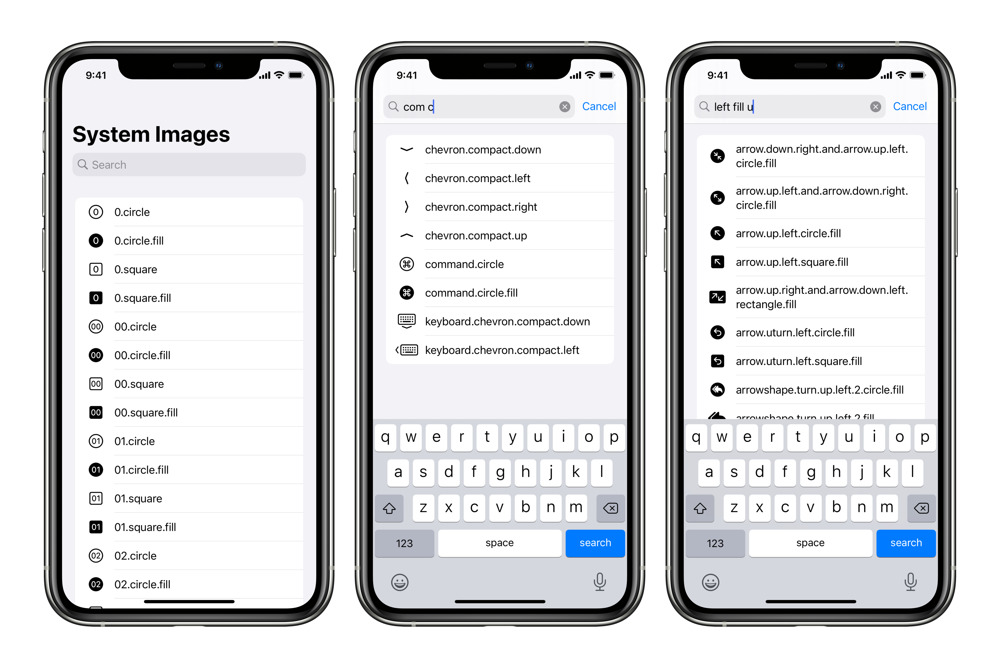

## SmartSearchExample

A sample app which demonstrates a simple, smart search algorithm for browing SF Symbols on iOS/iPadOS 14.  

See my Medium article [A Simple, Smart Search Algorithm for iOS in Swift](https://medium.com/@hacknicity/a-simple-smart-search-algorithm-for-ios-in-swift-65f71b2f221a) for an explanation of the algorithm and how it is used in this sample app.

    

